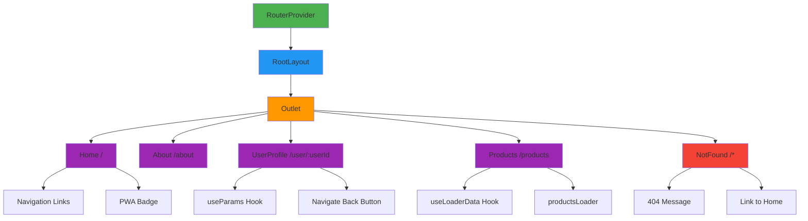
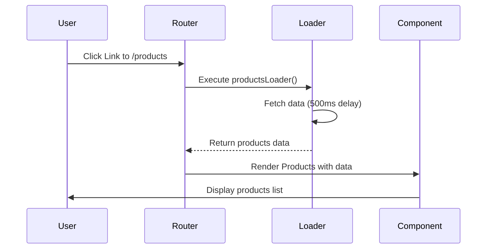
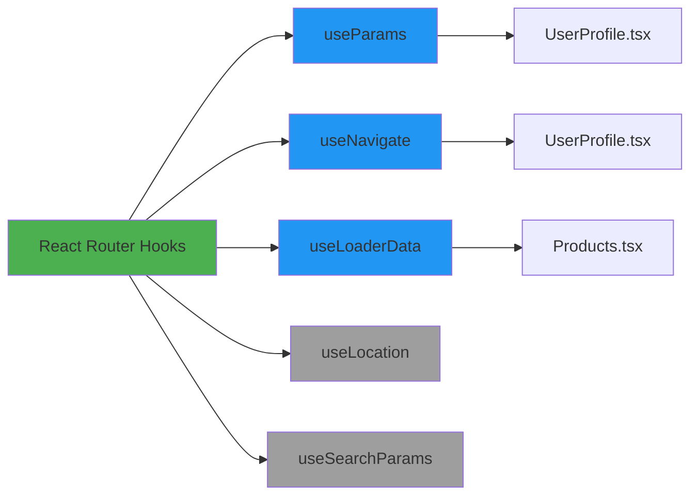
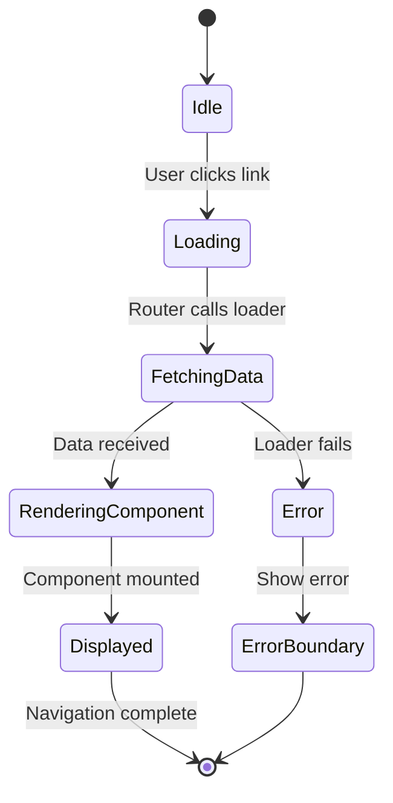
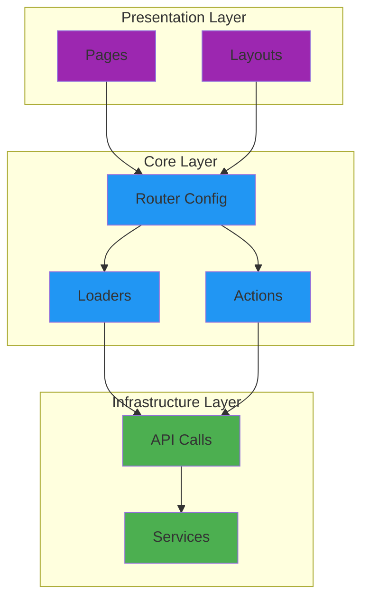

# 🗺️ Estructura de Rutas - React Router v7

## Diagrama de Rutas



## Flujo de Navegación



## Estructura de Archivos

```
src/
├── main.tsx
│   └── createBrowserRouter(routes)
│       └── RouterProvider
│
├── core/
│   └── router/
│       ├── routes.tsx
│       │   └── RouteObject[]
│       │       ├── path: "/"
│       │       ├── element: <RootLayout />
│       │       └── children: [...]
│       │
│       ├── loaders/
│       │   └── productsLoader.ts
│       │       └── async function
│       │
│       └── index.ts
│           └── export { routes }
│
└── presentation/
    ├── layouts/
    │   └── RootLayout.tsx
    │       └── <Outlet />
    │
    └── pages/
        ├── Home.tsx
        │   └── <Link> components
        ├── About.tsx
        ├── UserProfile.tsx
        │   ├── useParams()
        │   └── useNavigate()
        ├── Products.tsx
        │   └── useLoaderData()
        └── NotFound.tsx
```

## Hooks Utilizados



## Ciclo de Vida de una Ruta con Loader



## Comparación: Antes vs Después

### Antes (Sin Router)

```
main.tsx
  └── <Home />
```

### Después (Con React Router v7)

```
main.tsx
  └── <RouterProvider>
        └── <RootLayout>
              └── <Outlet>
                    ├── <Home />
                    ├── <About />
                    ├── <UserProfile />
                    ├── <Products />
                    └── <NotFound />
```

## Patrones de Rutas

### 1. Ruta Estática

```
/about → <About />
```

### 2. Ruta Dinámica

```
/user/:userId → <UserProfile />
  ├── /user/123
  ├── /user/456
  └── /user/abc
```

### 3. Ruta con Loader

```
/products → loader() → <Products />
```

### 4. Ruta Catch-All

```
/* → <NotFound />
```

## Arquitectura de Capas



---

**Leyenda de Colores**:

- 🟢 Verde: Router/Provider
- 🔵 Azul: Layouts/Core
- 🟣 Morado: Pages/Components
- 🟠 Naranja: Outlet
- 🔴 Rojo: Error/404
